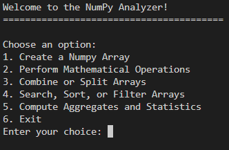
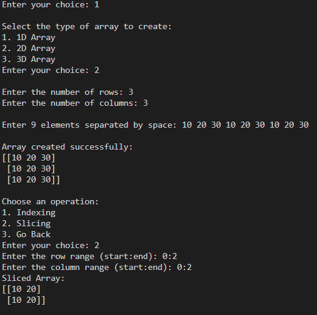
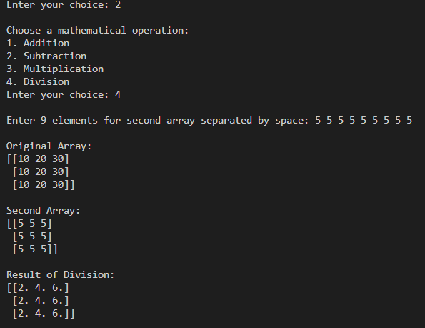
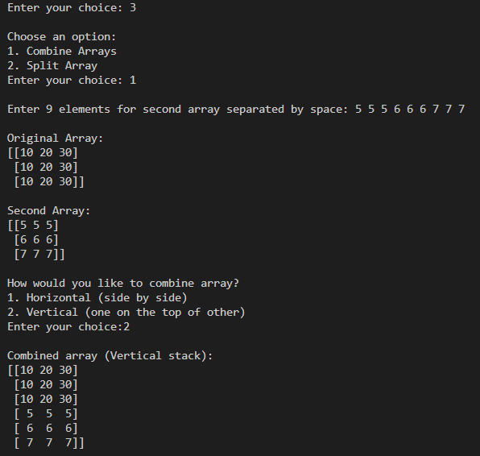
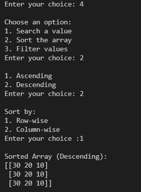
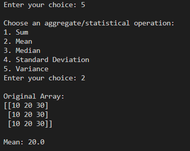
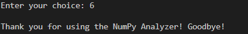

<div align="center">

# 🔢 NumPy Analyzer

### *Explore, manipulate, and analyze arrays — interactively.*


<br/>

> 💡 **A fully interactive, menu-driven NumPy playground** — built with OOP principles to create, manipulate, analyze, and visualize arrays across 1D, 2D, and 3D dimensions.

<br/>

---

</div>

## 📌 About This Project

**NumPy Analyzer** is a command-line application that brings the full power of NumPy to an intuitive, menu-driven interface. Instead of writing scripts, users interactively create arrays, run operations, and view results — making it a great learning tool and a strong demonstration of **OOP design**, **NumPy proficiency**, and **clean Python architecture**.

---

## ✨ Features at a Glance

| #  | Feature | Description |
|----|---------|-------------|
| 1️⃣ | **Array Creation** | Build 1D, 2D, or 3D arrays with custom elements |
| 2️⃣ | **Math Operations** | Add, subtract, multiply, or divide two arrays |
| 3️⃣ | **Combine & Split** | Stack arrays horizontally/vertically, split into parts |
| 4️⃣ | **Search, Sort & Filter** | Find values, sort ascending/descending, filter by threshold |
| 5️⃣ | **Statistics** | Compute sum, mean, median, std deviation & variance |
| 6️⃣ | **Indexing & Slicing** | Access specific elements or sub-arrays with precision |

---

## 🖥️ Screenshots

<table>
  <tr>
    <td align="center"><b>🏠 Main Menu</b></td>
    <td align="center"><b>🧱 Array Creation & Slicing</b></td>
  </tr>
  <tr>
    <td></td>
    <td></td>
  </tr>
  <tr>
    <td align="center"><b>➗ Math Operations</b></td>
    <td align="center"><b>🔗 Combine Arrays</b></td>
  </tr>
  <tr>
    <td></td>
    <td></td>
  </tr>
  <tr>
    <td align="center"><b>🔃 Sort & Filter</b></td>
    <td align="center"><b>📊 Statistics</b></td>
  </tr>
  <tr>
    <td></td>
    <td></td>
  </tr>
  <tr>
    <td align="center"><b>👋 Exit</b></td>
    <td></td>
  </tr>
  <tr>
    <td></td>
    <td></td>
  </tr>
</table>

---

## 🔁 Program Flow

```
┌──────────────────────────────────────────────────────┐
│                  🟢 Program Start                    │
│             NumPy Analyzer Initializes               │
└─────────────────────┬────────────────────────────────┘
                      │
                      ▼
┌──────────────────────────────────────────────────────┐
│                 📋 Main Menu Loop                    │
│  ┌─────────────────────────────────────────────────┐ │
│  │  1 ── Create Array     4 ── Search/Sort/Filter  │ │
│  │  2 ── Math Operations  5 ── Statistics          │ │
│  │  3 ── Combine/Split    6 ── Exit                │ │
│  └─────────────────────────────────────────────────┘ │
└──┬────────┬──────────┬──────────┬──────────┬─────────┘
   │        │          │          │          │
   ▼        ▼          ▼          ▼          ▼
┌──────┐ ┌──────┐ ┌────────┐ ┌────────┐ ┌────────┐
│Create│ │ Math │ │Combine │ │ Search │ │  Stats │
│Array │ │  Ops │ │ /Split │ │  Sort  │ │        │
└──┬───┘ └──┬───┘ └───┬────┘ └───┬────┘ └───┬────┘
   │        │         │          │           │
   ▼        │         ▼          ▼           ▼
┌──────────┐│  ┌────────────┐ ┌──────────┐ ┌──────────┐
│1D/2D/3D  ││  │hstack      │ │Search    │ │Sum / Mean│
│Array     ││  │vstack      │ │Sort ↑↓   │ │Median    │
│──────────││  │vsplit      │ │Filter >n │ │Std / Var │
│Indexing  ││  │hsplit      │ └──────────┘ └──────────┘
│Slicing   ││  └────────────┘
└──────────┘│
            ▼
     ┌────────────┐
     │+  -  *  /  │
     │(elementwise│
     │ operations)│
     └────────────┘
                      │
                      ▼
┌──────────────────────────────────────────────────────┐
│                  🔴 Exit (Choice 6)                  │
│              Goodbye Message Displayed               │
└──────────────────────────────────────────────────────┘
```

---

## 🧠 Concepts & Skills Demonstrated

| Concept | Details |
|---|---|
| 🏗️ **OOP Design** | Entire app structured as a `DataAnalytics` class with dedicated methods |
| 📦 **NumPy Core** | `np.array`, `reshape`, `hstack`, `vstack`, `vsplit`, `hsplit`, `sort` |
| 📐 **Array Dimensions** | Creating and working with 1D, 2D, and 3D arrays |
| 🔍 **Indexing & Slicing** | Row/column-based access with range inputs |
| 📊 **Statistics** | `np.sum`, `np.mean`, `np.median`, `np.std`, `np.var` |
| 🔄 **match-case** | Python 3.10+ structural pattern matching for clean branching |
| ✅ **Input Handling** | Dynamic element count prompts based on array shape |

---

## 🛠️ Tech Stack

<div align="center">


</div>

---

## ▶️ How to Run

```bash
# 1. Clone the repository
git clone https://github.com/HarshalVara86/Numpy_Analyzer.git

# 2. Navigate into the project folder
cd Numpy_Analyzer

# 3. Install NumPy (if not already installed)
pip install numpy

# 4. Run the analyzer
python PR-8.py
```

> ✅ Requires **Python 3.10+** for `match-case` support.

---

## 💡 Example Walkthrough

```
> Choose: 1 (Create Array) → 2D → 3x3 → [10 20 30 10 20 30 10 20 30]
  Array: [[10 20 30], [10 20 30], [10 20 30]]

> Choose: 2 (Math Ops) → Division → second array all 5s
  Result: [[2. 4. 6.], [2. 4. 6.], [2. 4. 6.]]

> Choose: 4 (Sort) → Descending → Row-wise
  Result: [[30 20 10], [30 20 10], [30 20 10]]

> Choose: 5 (Statistics) → Mean
  Mean: 20.0
```

---

## 🗺️ Roadmap

- [x] 1D, 2D, 3D Array Creation
- [x] Mathematical Operations
- [x] Combine & Split Arrays
- [x] Search, Sort & Filter
- [x] Aggregate Statistics
- [ ] Save results to CSV/Excel 🔜
- [ ] Matplotlib visualization integration 🔜
- [ ] File-based array import 🔜

> 🌱 *Actively maintained — ⭐ star the repo to stay updated!*

---

## 📄 License

This project is licensed under the **MIT License** — free to use, learn from, and build upon.

---

<div align="center">

*Built with ❤️, 🐍 Python, and 🔢 NumPy by Harshal Vora*

⭐ **Found this useful? Give it a star and share it!** ⭐

</div>
